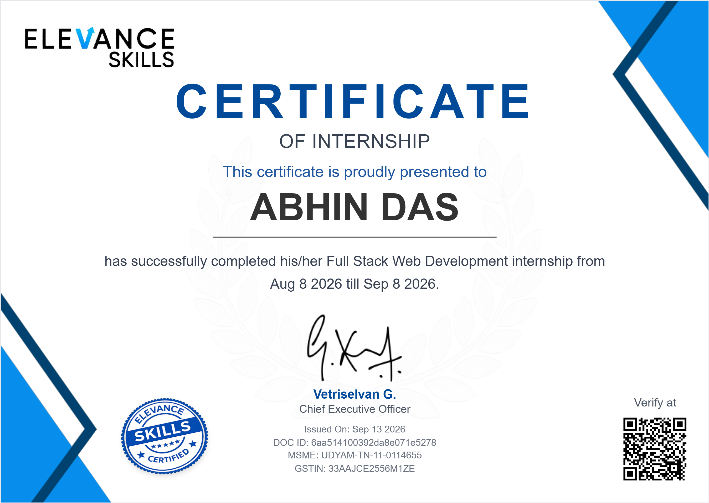
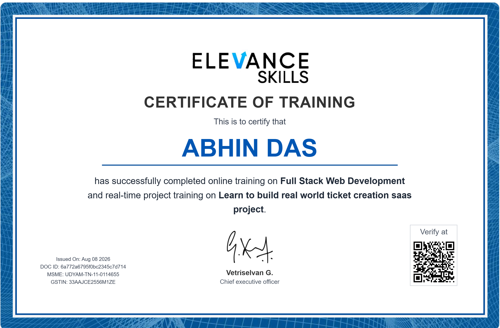

# Jira Clone

A full-stack project management tool inspired by Jira — Kanban board, backlog, sprints, subtasks with dependencies, time tracking, file attachments, notifications, and live multi-user collaboration.

**Live demo:** https://jira-clone-abhin-das.vercel.app/
**Backend:** https://jira-sim.onrender.com/

---

## Tech Stack

**Frontend:** Next.js 16 (React 19, App Router), TypeScript, Tailwind CSS, Radix UI, `@dnd-kit` (drag-and-drop), `@stomp/stompjs` + SockJS (realtime)
**Backend:** Spring Boot 3, Java 17, MongoDB, Spring Security + JWT, Spring WebSocket (STOMP)
**Email:** Brevo (transactional email API)
**Deployment:** Vercel (frontend), Render (backend), MongoDB Atlas (database)

---

## Features

### Kanban Board & Backlog
Drag-and-drop issue board (To Do / In Progress / Done) alongside a dedicated backlog view. Projects contain sprints; only one sprint can be active at a time, and completing a sprint automatically moves its unfinished issues back to the backlog.

### Issues, Subtasks & Dependencies
Issues can have subtasks, which inherit their parent's project and sprint and can't diverge from it — a parent can't be marked Done until every subtask is. Cross-issue dependencies are supported with cycle detection, so a task can never depend on something that (even transitively) depends on it. Completing a blocking task automatically clears it from the dependent issue's blocked-by list and notifies whoever was waiting.

### Time Tracking
Per-issue work logs (date, duration, description) roll up into per-issue and per-sprint totals. Edits and deletions are written to an audit log, and only the issue's assignee or the project owner can modify entries.

### Real-Time Collaboration
STOMP over WebSocket keeps every viewer of a project in sync — issue creation, updates, moves, and comments appear live for everyone on that board, alongside a presence indicator showing who else is currently viewing.

### Notifications
In-app and email notifications for assignment, status changes, blocking-task completion, and due dates — deduplicated per event so nothing notifies twice. Due-date reminders fire in three tiers (24h / 10h / 90min before deadline) via a scheduled sweep.

### Attachments
File uploads per issue, restricted to PDF/PNG/JPG/DOCX under 10MB, validated by both declared type and actual file signature — not just the extension.

### Auth & Profile Security
JWT-based login, an email-change flow requiring OTP or a confirmation link, password strength rules, and account deactivation that preserves historical activity for auditing.

---

## Project Structure

```
client/   Next.js frontend
server/   Spring Boot backend
```

## Getting Started

### Backend

```bash
cd server
cp src/main/resources/application.properties.example src/main/resources/application.properties
# fill in your MongoDB URI, JWT secret, and (optionally) Brevo API key
./mvnw spring-boot:run
```

Runs on `http://localhost:8080`.

### Frontend

```bash
cd client
npm install
npm run dev
```

Runs on `http://localhost:3000`. Set `NEXT_PUBLIC_API_BASE_URL` in a `.env.local` file if the server isn't on `localhost:8080`.

---

## Notes

- The backend runs on Render's free tier, which spins down after ~15 minutes of inactivity — scheduled jobs can't run while it's asleep. Due-date reminders use a request-triggered fallback sweep that piggybacks on ordinary API traffic, so they stay roughly on schedule regardless of whether the cron tick itself got skipped while the server slept.
- Email (notifications and email-change verification) requires a Brevo API key. Without one, the email-change flow falls back to showing the OTP/confirmation link directly on screen instead of sending it.
- Due dates are stored as proper UTC instants, converted using the browser's own timezone at input time — a due date set by a user in any timezone fires its reminders at the correct moment for them, not the server's.

---

## Deployment

The server ships with a `Dockerfile` (builds and runs the Spring Boot jar). The client deploys as a standard Next.js app (e.g. Vercel).

## Certifications

<table width="100%">
  <tr>
    <td width="50%" style="padding-right: 16px;"></td>
    <td width="50%" style="padding-left: 16px;"></td>
  </tr>
</table>
